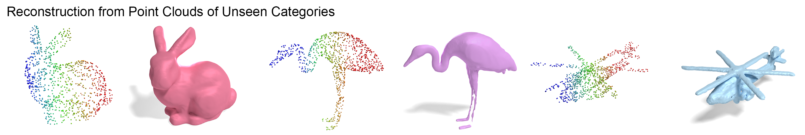

# Neural Signed Distance Functions

This repository contains a codebase for easy reproduction and incorporation of SDF and Occupancy methods. Currently includes GenSDF, DeepSDF, Convolutional Occupancy Networks, and NeuralPull. Note that these methods except for GenSDF are **not** necessarily optimized and may require minor tweaks (e.g., hyperparameter changes) for optimal performance; we encourage users to validate with original implementations. We provide links and references below.


This repository is also the official implementation of <br> 
**GenSDF: Two-Stage Learning of Generalizable Signed Distance Functions** <br>
Gene Chou, Ilya Chugunov, Felix Heide  

[**Paper and Supplementary**](https://arxiv.org/abs/2206.02780) <br>

<div style="text-align: center">

</div>

If you find our code or paper useful, please consider citing
```bibtex
@article{chou2022gensdf,
  title={GenSDF: Two-Stage Learning of Generalizable Signed Distance Functions},
  author={Chou, Gene and Chugunov, Ilya and Heide, Felix},
  journal={arXiv preprint arXiv:2206.02780},
  year={2022}
}
```


```cpp
SDF lib
  ├── config  
  │   └── // folders for checkpoints and training configs
  ├── data  
  │   └── // folders for data; in csv format
  ├── model  
  │   ├── gensdf
  │   │   └── model.py
  │   ├── deepsdf
  │   │    └── model.py 
  │   ├── archs
  │   │    └── encoders
  │   │        └── // pointnet, auto-decoder...etc
  │   │    └── decoders
  │   │        └── // 8-layer MLP, SIREN...etc
  │   └── ... // add your own models
  ├── dataloader  
  │   └── // dataloaders for labeled and unlabeled data are provided
  ├── utils  
  │   └── // scripts for reconstruction and evaluation
  ├── environment.yml  // package requirements
  ├── train.py  // script for training; change dataloader here
  ├── test.py  // script for testing given a defined testing dataloader
  └── test_single.py  // script for testing given a single input point cloud
  
```


## Installation
We recommend creating an [anaconda](https://www.anaconda.com/) environment using our provided `environment.yml`:

```
conda env create -f environment.yml
conda activate sdf
```
**Note**: you might need to install **torch-scatter** manually following [the official instruction](https://github.com/rusty1s/pytorch_scatter#pytorch-140):
```
pip install torch-scatter
```


## Demo (for GenSDF)
Run `test_single.py`. Load a point cloud in csv format (see `data/acronym`) or ply format (see `data/ycb`) and visualize reconstructions.
```
# give file path and output directory
python test_single.py -f data/acronym/Bear/52f9a230c400bddd55330ea4156a425f/sdf_data.csv -o . 
```


## Dataset

For training, we first recenter and normalize input data. We also apply these steps for an input point cloud in `test_single.py`. See supplement for an explanation. For training, we preprocess all files and store results in csv format. Each csv file corresponds to one object, and each line represents a coordinate followed by its signed distance value. See `data/acronym` for examples. <br>

For labeled data (i.e., meshes), we recommend first recentering and normalizing the object, then sample point clouds and query points. The ground truth signed distance values for all points can be calculated from the mesh and stored into csv files. <br>

We train using the [Acronym](https://github.com/NVlabs/acronym) dataset. Place your dataset in the `data` folder following the current structure, and provide the train/test split in the `config` spec files.


## Training
We provide pretrained models for GenSDF. Users are also welcome to train from scratch using the following commands

```
python train.py -e config/gensdf/semi -b 64 -r last  # remove -r to train from scratch
python train.py -e config/deepsdf -b 64 -w 12        # -b for batch size, -w for workers
```
Feel free to modify `specs.json` files in `config`.
One can also mix and match encoders and decoders that are provided.


## Testing
For testing single objects, see the **Demo** section above. For testing on multiple objects, define a dataloader and run the `test.py` file

```
python test.py -e config/gensdf/semi -r last 
```


## References
We adapt code from <br>
DeepSDF https://github.com/facebookresearch/DeepSDF <br>
Convolutional Occupancy Networks https://github.com/autonomousvision/convolutional_occupancy_networks <br>
NeuralPull https://github.com/bearprin/neuralpull-pytorch/tree/history-2